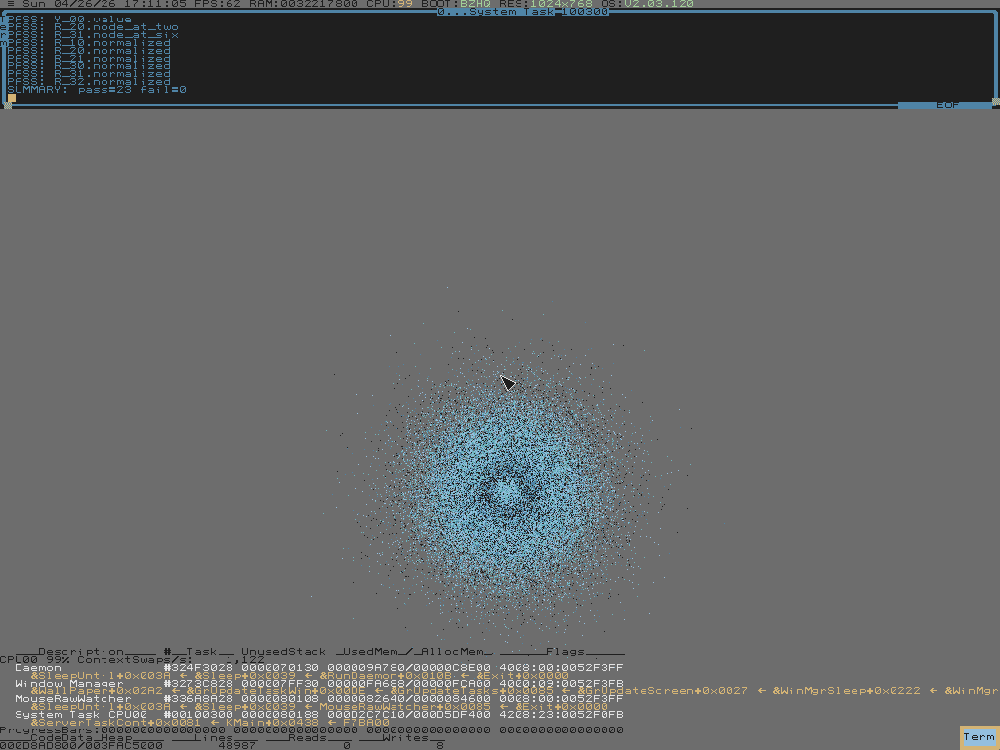

# electron-orbitals-demo

Hydrogen-atom electron clouds, rendered in HolyC on ZealOS, in QEMU.
Closed-form wavefunctions, Monte-Carlo sampled, plotted to the
framebuffer. The cloud is the point. The dev loop is what made it
tractable.



The 2s orbital above: bright inner core, dark spherical node ring at
r ≈ 2 a₀ where ψ_2s crosses zero, brighter outer shell. Rendered
directly from `R_20(r) · Y_00(θ,φ)` — no fitted constants.

## What's in here

- **`src/Wavefunc.ZC`** — closed-form `R_nl(r)` for n=1,2,3, the
  s-shell spherical harmonic `Y_00`, and a trapezoidal radial-norm
  helper. Atomic units (Z=1, a₀=1).
- **`src/Orbital.ZC`** — radial CDF + inverse sampler, paired with a
  uniform-sphere direction sample. `ScatterSOrbital(n, r_max, scale,
  count)` plots `count` Monte-Carlo samples to the screen DC.
- **`tests/T_Wavefunc.ZC`**, **`tests/T_Orbital.ZC`** — anchor every
  closed form to a known numeric value and to its analytic
  expectation: `R_10(0)=2`, `R_20(2)=0` (the radial node), `Y_00 =
  1/(2√π)`, ∫|R|²r²dr = 1 for every (n,l), and ⟨r⟩ from the sampler
  vs `½[3n² − l(l+1)]` for 1s/2s/2p/3s.

23/23 tests green.

## Run it

Fresh clone, fresh disk. Prerequisites: `qemu-system-x86_64` (`brew
install qemu`), the standard macOS toolchain (hdiutil, dd, python3,
nc, sips), ~5 GB free.

```sh
make setup           # fetch ZealOS BIOS ISO (~44 MB)
make disk            # create blank 4 GB qcow2
make install         # interactive install — y / I / Y at the prompts
                     # close QEMU when ZealOS desktop is up
scripts/zctl up      # start the dev VM, dismiss boot menu, wait for daemon
scripts/zctl wire    # one-shot post-install: mount shuttle + Setup.ZC
scripts/zctl down && scripts/zctl up   # subsequent boots auto-mount
```

Then:

```sh
make test                                    # 23/23 should pass
scripts/zctl eval '#include "E:/Orbital.ZC"; ScatterSOrbital(2, 25.0, 12.0, 60000);'
scripts/zctl screenshot
```

Try `1` for 1s, `3` with `r_max=50, scale=6` for 3s.

## How it works

Sampling `|ψ_n00(r,θ,φ)|² r² sin θ dr dθ dφ`:

1. Build a CDF of `p(r) = |R_n0(r)|² r²` over `[0, r_max]`. Inverse
   sample to get a radius.
2. Y_00 is isotropic, so the angular part is a uniform direction on
   the sphere: `u = 2·Rand() − 1`, `φ = 2π·Rand()`, then
   `(x,y,z) = r·(sin θ cos φ, sin θ sin φ, cos θ)` with `cos θ = u`.
3. Project orthographically (drop z, modulate color by depth), plot.

For the math see any standard QM text — Griffiths, Cohen-Tannoudji.
The closed forms for `R_nl` are textbook, just written out.

## What's not in here yet

- **p / d orbitals.** Need real `Y_lm(θ,φ)` sampling — for non-zero
  l the angular distribution isn't uniform. `Y_00` is the only
  spherical harmonic implemented today.
- **Volume rendering.** Current output is point-cloud + 4-bucket
  depth dither. A proper 16-color density-summed render would look
  better; the framebuffer is 640×480 with 16 colors so there's a hard
  ceiling on quality.
- **Live rotation.** The cloud is one-shot; no animation loop. Easy
  follow-up.

## Upstream

Built on top of [`rshtirmer/templeos-devkit`](https://github.com/rshtirmer/templeos-devkit) —
the host↔guest dev-loop scaffolding (shuttle disk, serial-out test
harness, REPL daemon over COM2). For full devkit documentation see
upstream's docs.

Several improvements from this fork are open as PRs against upstream:
QEMU display fix for macOS Retina, host-side HolyC tooling
(VSCode/Neovim/linter), `scripts/zctl` (single-process control plane
for the VM with synchronous eval), and a couple of unused-variable
warning suppressions that were polluting the framebuffer.

## Agent guide

[`CLAUDE.md`](CLAUDE.md) is the agent onboarding doc — covers `zctl`
usage, the daemon protocol, and the HolyC quirks we hit during this
build. Read it before writing HolyC.

## Credits

- [Terry A. Davis](https://en.wikipedia.org/wiki/Terry_A._Davis),
  1969–2018 — wrote TempleOS, HolyC, the editor, the compiler, the
  games, the oracle, alone.
- [ZealOS](https://github.com/Zeal-Operating-System/ZealOS) — the
  modernized 64-bit fork we actually run.
- The hydrogen wavefunctions are textbook quantum mechanics; the
  novelty is purely in writing them out in HolyC.
