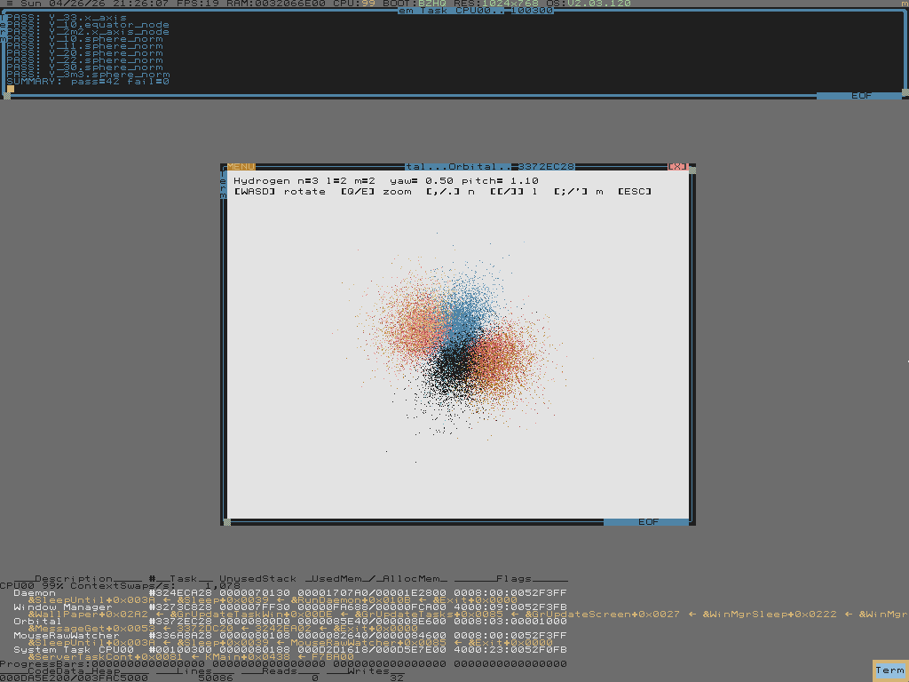
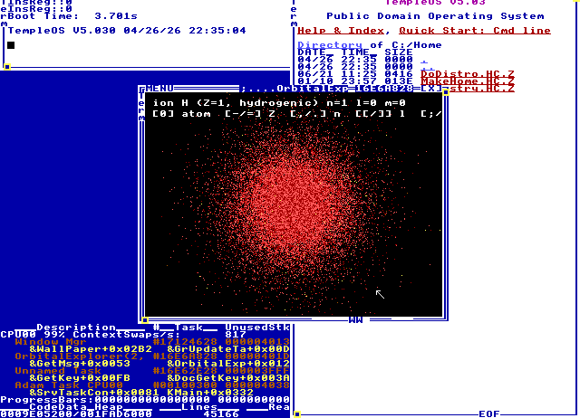
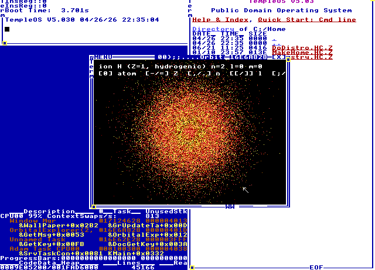
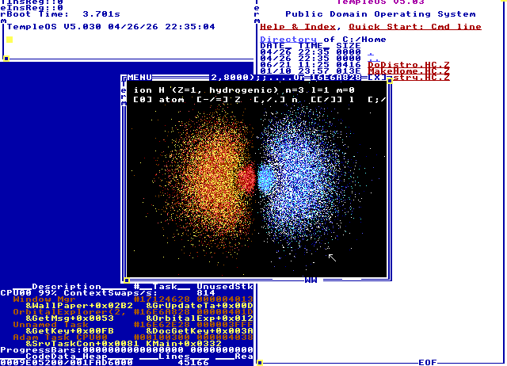
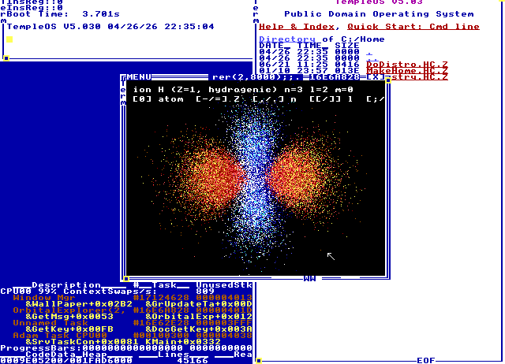
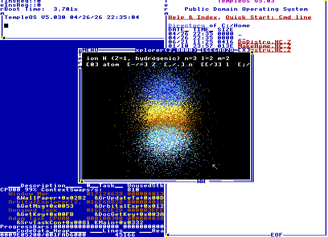
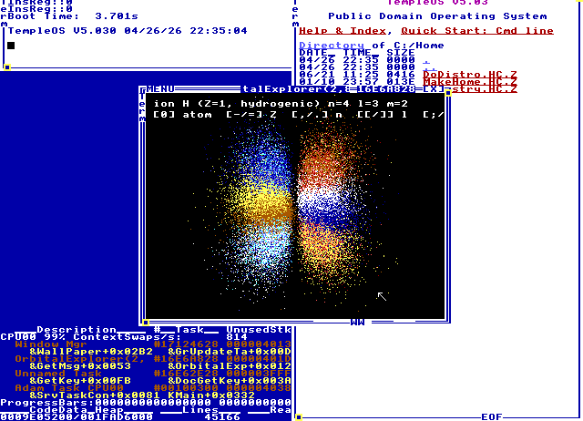

# electron-orbitals-demo

Hydrogen-atom electron clouds, rendered in HolyC, sampled by Monte
Carlo from real wavefunctions, phase-coloured, plotted live to the
framebuffer. Runs on **both ZealOS and stock TempleOS** (Terry's 2017
Distro) under QEMU. The cloud is the point. The dev loop is what made
it tractable.



Above: the **3d_x²-y²** orbital viewed near top-down. Four lobes
alternating red ↔ blue around the equator — that's the *sign* of
Y₂,₂(θ,φ), not artistic license. Sampled from `R_32(r) · Y₂,₂(θ,φ)`
by Monte Carlo, no fitted constants, ~25k points.

## Same code, on stock TempleOS

The same `src/*.ZC` files run unmodified on Terry's 2017 Distro
itself, side-by-side with the ZealOS path. The host streams source
over a COM2 chardev socket, JIT-compiles each chunk in `adam_task`,
and hands adam its REPL back so the explorer takes over the WM tile
with full chrome (resize handles, drag, [X]).

| 1s — solid sphere, no nodes | 2s — radial node ring at r ≈ 2 a₀ |
|---|---|
|  |  |
| **3p_z — phase-coloured dumbbell** | **3d_z² — donut + dumbbell hybrid** |
|  |  |
| **3d_xy (m=2) — clover with alternating phase** | **4f — high-l, three-lobed** |
|  |  |

These are unretouched QEMU framebuffer captures — that's the actual
TempleOS desktop around the orbital window: file directory on the
right, task list at the bottom, "Public Domain Operating System" up
top. 73/73 tests pass on stock TempleOS.

## What's in here

- **`src/Wavefunc.ZC`** — general `Rnl(n, l, r)` via the associated-
  Laguerre recurrence (any n, any l < n), real spherical harmonics
  `Y_lm` for l = 0..3 (s/p/d/f), and a grid-scan envelope for
  rejection sampling. Atomic units (Z = 1, a₀ = 1).
- **`src/Orbital.ZC`** — radial CDF + inverse sampler; angular
  distribution sampled from |Y_lm|² by rejection. `ScatterSOrbital`
  for one-shot rendering, `BuildRadialCDF`/`SampleR`/`SampleAnglesLM`
  as building blocks.
- **`src/OrbitalUI.ZC`** — interactive explorer (`OrbitalExplorer`,
  `OrbitalExplorerLaunch` for a real WM tile). Held WASD rotates,
  Q/E zooms, `,/.` step n, `[/]` step l, `;/'` step m, `-/=` step Z.
  Phase coloring drives a warm/cool palette so you can see the
  alternating-sign lobe structure of every p/d/f orbital.
  Auto-rotates when idle.
- **`src/Atom.ZC`** — `AtomConfig(Z, &shells, ...)` for any Z up to
  118 and Slater-shielded Z_eff per shell. Lets the explorer flip
  between hydrogenic ions and full multi-electron atoms with the
  outermost occupied shell auto-snapped.
- **`tests/T_Wavefunc.ZC`**, **`T_Orbital.ZC`**, **`T_Atom.ZC`** —
  every closed form pinned to a known numeric value or analytic
  expectation: `Rnl(1,0,0) = 2`, `Rnl(2,0,2) = 0` (radial node),
  `Y_lm` spot values + sphere-norm ∫|Y_lm|² dΩ = 1, ∫|R_nl|² r² dr
  = 1 for n up to 7, ⟨r⟩ from the sampler vs `½[3n² − l(l+1)]` for
  shells through 7s, full electron configs for H..Fe.

73/73 tests green on ZealOS. 73/73 tests green on stock TempleOS.

## Run it (ZealOS — primary dev path)

Fresh clone, fresh disk. Prerequisites: `qemu-system-x86_64` (`brew
install qemu`), the standard macOS toolchain (hdiutil, dd, python3,
nc, sips), ~5 GB free.

```sh
make setup           # fetch ZealOS BIOS ISO (~44 MB)
make disk            # create blank 4 GB qcow2
make install         # interactive install — y / I / Y at the prompts
                     # close QEMU when ZealOS desktop is up
scripts/zctl up      # start the dev VM, dismiss boot menu, wait for daemon
scripts/zctl wire    # one-shot post-install: mount shuttle + Setup.ZC
scripts/zctl down && scripts/zctl up   # subsequent boots auto-mount
```

Then:

```sh
make test                                                # 73/73
scripts/zctl eval '#include "E:/OrbitalUI.ZC"; OrbitalExplorerLaunch;'
scripts/zctl screenshot
```

That spawns a real WM-tiled explorer. Inside it:

| key   | action                                              |
|-------|-----------------------------------------------------|
| WASD  | yaw / pitch (held — smooth, manual rotation)        |
| Q / E | zoom out / in (held — multiplicative, smooth)       |
| `,` `.` | step n (1..7)                                     |
| `[` `]` | step l (0..n-1, capped at f)                      |
| `;` `'` | step m (-l..+l)                                   |
| `-` `=` | step Z (1..118, with atom mode on)                |
| `0`   | toggle ion ↔ atom mode                              |
| ESC   | quit                                                |

The cloud auto-rotates after 3 s without manual rotation. Stepping
through n / l / m / Z or zooming doesn't reset the idle timer, so you
can browse the orbital zoo while it keeps spinning.

## Run it (stock TempleOS — second target)

```sh
make setup-temple    # fetch templeos.org/Downloads/TempleOS.ISO
make disk-temple     # blank 4 GB qcow2 in vendor/templeos/
make install-temple  # interactive — answer 'n' to tour, accept defaults
                     # close the QEMU window when desktop appears
make dev-temple      # boot disk + COM2 socket
                     #   in QEMU window: '1<Enter>' at the boot menu,
                     #   then 'n<Enter>' at the Once.HC tour prompt
make test-temple     # in another shell — types daemon, pushes battery, ~2 min
make launch-temple   # push src files, hand the explorer to adam's REPL
```

The TempleOS path is fundamentally different from ZealOS — there's no
shuttle disk, FAT32 reads from the secondary IDE slot are unreliable
on the 2017 distro, and ISO9660 mounts error out on `Drv()` switch.
Instead, `scripts/temple-run.py` types a tiny in-memory JIT daemon
into `adam_task` over the QEMU monitor (`sendkey`), then streams each
`.ZC` file as raw bytes through a COM2 chardev socket. The daemon
calls `ExePutS(buf)` on each chunk — JIT-compiles in memory, no disk
write or `#include`. Same code, different transport. ZealOS↔TempleOS
API renames (`MessageGet/GetMsg`, `mouse/ms`, `tS/cnts.jiffies`, etc.)
are auto-substituted on push.

For the gory details of why this is the way it is — and the upstream
PRs that ship this as a generic capability — see
[`CLAUDE.md`](CLAUDE.md).

## How it works

Sampling `|ψ_nlm(r, θ, φ)|² r² sin θ dr dθ dφ`:

1. **Radial.** Build a CDF of `p(r) = |R_nl(r)|² r²` over `[0, r_max]`
   on a 4 000-step grid. Inverse-sample for r. `R_nl` is computed
   from the associated-Laguerre recurrence, so any (n, l) with l < n
   works — n up to 7 is exercised by the tests.
2. **Angular.** For l > 0 the distribution isn't uniform. We sample
   directions by **rejection on |Y_lm|²** with a uniform-on-sphere
   proposal — the envelope is a grid-scan max of |Y_lm|² scaled by
   1.05. One-time cost paid at cloud generation, not per frame.
3. **Phase.** Record sign(Y_lm) at each sample. Render warm palette
   (brown → red → light-red → yellow) for positive lobes, cool palette
   (blue → light-blue → cyan → white) for negative; depth modulates
   brightness. So a p_z dumbbell comes out red on one side, blue on
   the other — the way the textbook draws it.
4. **Interaction.** Sample once into a body-frame point cloud, then
   apply yaw-pitch + an auto-fit · zoom scale per frame. Rotation and
   zoom never resample, so they stay smooth even at 25k+ points.

For the math see any standard QM text — Griffiths, Cohen-Tannoudji.

## Upstream

Built on top of [`rshtirmer/templeos-devkit`](https://github.com/rshtirmer/templeos-devkit) —
the host↔guest dev-loop scaffolding (shuttle disk, serial-out test
harness, REPL daemon over COM2). For full devkit documentation see
upstream's docs.

Improvements from this fork are open as PRs against upstream:
QEMU display fix for macOS Retina, host-side HolyC tooling
(VSCode/Neovim/linter), `scripts/zctl` (single-process control plane
for the VM with synchronous eval), unused-variable warning
suppressions — and now the **TempleOS compat path itself**:
[#5 `TempleOS compat: run the same .ZC battery on Terry's 2017 distro`](https://github.com/rshtirmer/templeos-devkit/pull/5)
and [#6 `--launch[=CMD] for interactive viewers + ZealOS API compat subs`](https://github.com/rshtirmer/templeos-devkit/pull/6).

## Agent guide

[`CLAUDE.md`](CLAUDE.md) is the agent onboarding doc — covers `zctl`
usage, the daemon protocol, the HolyC quirks we hit during this
build, and the TempleOS-vs-ZealOS API differences worth knowing
before touching either path. Read it before writing HolyC.

## Credits

- [Terry A. Davis](https://en.wikipedia.org/wiki/Terry_A._Davis),
  1969–2018 — wrote TempleOS, HolyC, the editor, the compiler, the
  games, the oracle, alone.
- [ZealOS](https://github.com/Zeal-Operating-System/ZealOS) — the
  modernized 64-bit fork we use as the primary dev VM.
- The hydrogen wavefunctions are textbook quantum mechanics; the
  novelty is purely in writing them out in HolyC and running them on
  Terry's actual OS.
